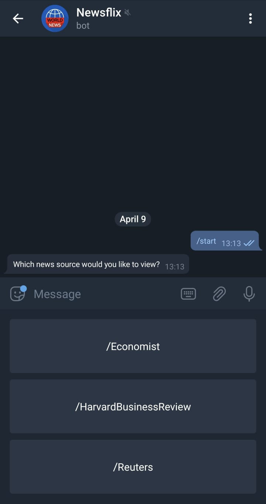
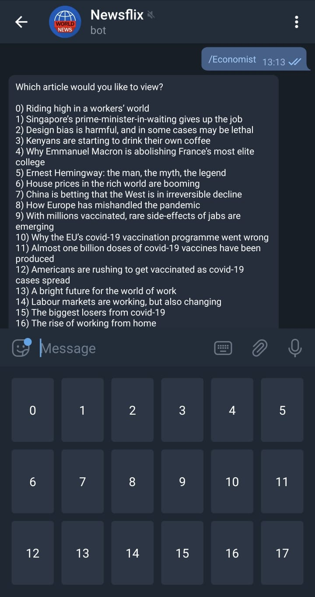

## Telegram News Bot

Link for Telegram News Bot: https://t.me/EconomicalBot

### Usage

- Send "/start" to activate the bot. Your keyboard will show the newspapers available (currently Economists, Harvard Business Review, and Reuters).

- Clicking on any of the options shows you the current headlines for the day, along with its index. Sending the index from the keyboard will bring you the entire article.

### Miscellaneous

- Scraping scripts are included in their respective python files.
- News article are fetched once every 12 hours and cached.
- Might not work properly if news website's html formatting changes.